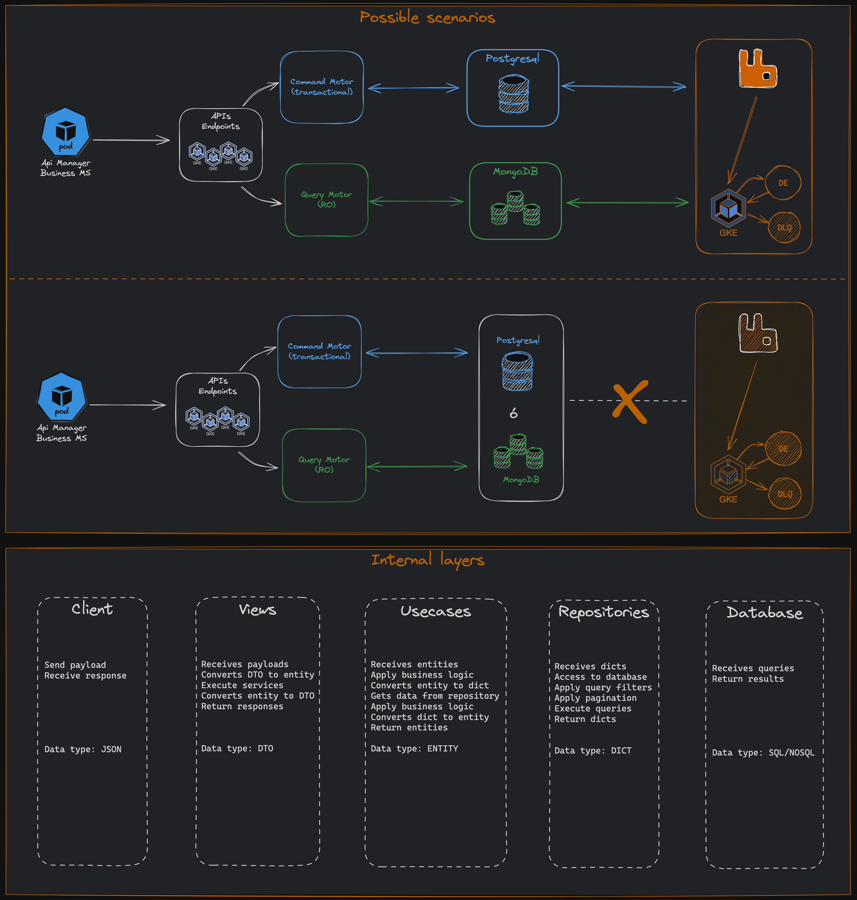

# Architecture
- [Architecture](#architecture)
- [The big picture](#the-big-picture)
- [Code Map](#code-map)
	- [Directories](#directories)
		- [src/](#src)
		- [tests/](#tests)
	- [Data structures](#data-structures)
		- [`PostgresqlDatabase`](#postgresqldatabase)
		- [`MongodbDatabase`](#mongodbdatabase)
		- [`RabbitMQBroker`](#rabbitmqbroker)
	- [Queues](#queues)
		- [ETL](#etl)
	- [Files](#files)

# The big picture


# Code Map

This section talks briefly about various important directories and data structures.

## Directories

### src/

In this directory you will find Atlas's source code, which in turn is divided into the following 4 layers:

 - **application** This layer contains our use cases implementations for command and query access. This usecases had to heritate from our interfaces definitions located in the domain layer. The first level of this directory should be directories with the name of the domain model to which the use cases that i am going to add there belong.
 - **domain** In this layer we have entities with business logic (to avoid [Anemic Models](https://martinfowler.com/bliki/AnemicDomainModel.html)), value objects, repositories interfaces and use cases interfaces considered relevant modules. This layer should not depend on layers such as infrastructure or presentation, but on the contrary, the interfaces found here are implemented in the other layers.
 - **infrastructure** It contains clients for external services such as database, queue manager or external APIs. Contains concrete implementations of some of the domain/application interfaces.
 - **presentation** In this layer you will find the code for the different ways a user could use Atlas. We have the code of our API, the definition of the resources, what our resources receive and what they return. We have the code of our Consumers, the definition of the handlers and what our handlers receive.

### tests/
This directory contains Atlas's test suite. The suite is divided into:

 - **unit** Here you will find business logic tests or tests that have no external dependencies. The tests that are placed here should be the fastest, errors in business logic should be detected after the execution of this suite.
 - **e2e** This suite allows to test the different entry points of my application, it should not contain mocks and all scenarios should be achieved using the behavior that the application offers through its interface, here we only validate what we get after executing a series of steps, by its nature we can not deject if X thing was called, we only review what we got to determine if the test was successful. They are tests from the perspective of the user or client of Atlas.

The CI pipeline is designed to run tests in the order in which they were described above. From the fastest to the slowest.

A question that may arise is why split the tests into sets (unit, e2e) and run each set one after the other? The decision is made by the fact that as the tests start to grow the execution can become slow, if we separate them we can determine at what point in our development flow it is convenient to run the groups of tests that take more time (e2e) and thus be able to run the tests that do not take much time more often.

## Data structures

These are the most relevant data structures:

#### `PostgresqlDatabase`
The Database implementation for Postgresql located in `infrastructure/database/postgresql/config.py` is PostgresqlDatabase. It contains logic to establish the connection that allows read and write data to the database using async sqlalchemy engine.

#### `MongodbDatabase`
The Database implementation for Mongodb located in `infrastructure/database/mongodb/config.py` is MongodbDatabase. It contains logic to establish the connection that allows read and write data to the database using async montor.

#### `RabbitMQBroker`
The Broker implementation for RabbitMQ located in `infrastructure/broker/rabbitmq/config.py` is RabbitMQBroker. It contains logic to establish the connection that allows publishing and consuming messages via AioPika.

## Queues

### ETL

#### atlas.service_bus

In this queue, messages are posted when new data is inserted and need to be replicated to the opposite database. The payload of published messages has the following structure:

```
{
  "name": // game name | str,
  "platform": // game platform | str from list,
  "stock": 50 // game quantity | positive int,
  "price": // game prince | positive int,
  "active": // game is active? | bool,
  "condition": // game condition | str from list,
  "uuid": // game unique identifier | uuid,
  "created_at": // game date of creation | datetime utc,
  "updated_at": // game date of update | datetime utc
}
```

The message handler for this queue is `replicate_data` and is located in `src/presentation/consumer/handlers/etl.py`.

If the message processing fails, a maximum of 3 retries will be made (this could change via the `rabbitmq_max_retries` environment variable), each of the retries are made with a delay between them (this could change via the `rabbitmq_delay_ms` environment variable). In worse cases if the message failed after 3 retries, it will be sent to a DLQ so we can inspect and debbug the data.

## Files

There are separated files in the root of the project, these are described below:

- `docker-compose.yml` is the base configuration to start the project independently
- `Dockerfile` is the repository image configuration
- `pyproject.toml` contains the dependencies necessary to run the project
- `.pre-commit-config.yaml` contains the pre-commit configurations to validate new code
- `README.md` contains a brief description of the project objective and general information that may be useful.
- `Makefile` contains all the shortcuts for run commands
- `renovate.json` contains the integration for renovate bot, that help us to keep libraries updated
- `.gitlab-ci.yaml` contains the configuration for CI and CD
